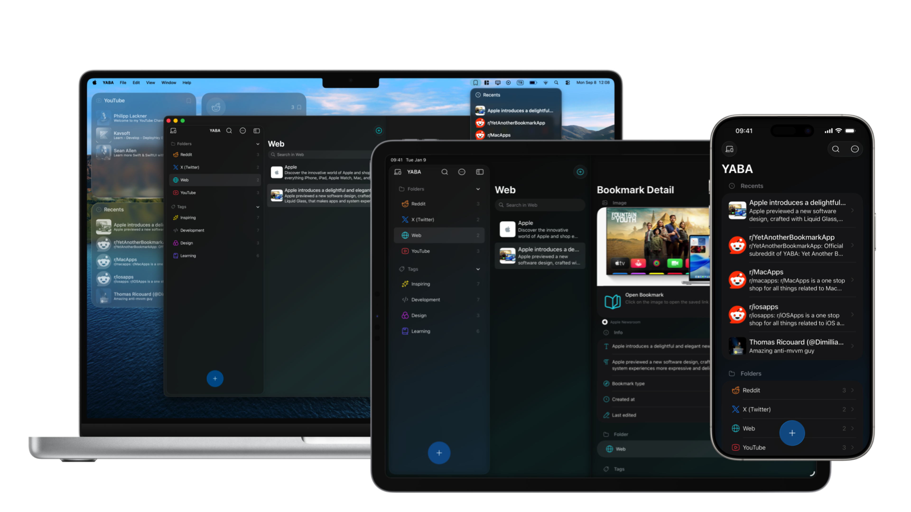

# YABA - Yet Another Bookmark App

A modern, cross-platform bookmark manager designed to provide a seamless bookmarking experience across ecosystems with complete privacy and offline-first approach.

## 💡 Planning
For the latest planning and roadmap, please visit the [Public Trello board](https://trello.com/b/hCgH33AC/yaba-board).

## 🏗️ Project Structure

```
YABA/
├── Darwin/                   # Apple Platform Implementation
│   ├── YABA/                 # Main iOS/macOS/visionOS App
│   ├── YABAShare/            # iOS Share Extension
│   ├── YABAShareMac/         # macOS Share Extension
│   ├── YABAKeyboard/         # iOS Keyboard Extension
│   ├── YABAWidgets/          # iOS/macOS Widget Extension
│   └── YABAStatusMenuItem/   # macOS Status Menu Item
├── Compose/                  # Android/JVM Platform Implementation
    └── (Future Compose Multiplatform code)
```

## 🎯 Project Vision

YABA aims to be the ultimate cross-platform bookmark manager with:
- **Native Performance**: Platform-specific implementations for optimal user experience
- **Server-less Sync**: Peer-to-peer data synchronization across devices without servers
- **Modern Architecture**: Built with the latest platform technologies
- **Extensible Design**: Modular architecture supporting future platforms
- **Privacy First**: All data stays on your devices, no tracking, no analytics
- **Offline First**: Works completely offline, syncs when connected
- **Always Free**: No premium features, no subscriptions, completely free

## 🛠️ Technology Stack

### Darwin Platform
- **UI Framework**: SwiftUI
- **Data Persistence**: SwiftData
- **Reactive Programming**: Combine
- **Concurrency**: Swift Concurrency (async/await)
- **Extensions**: WidgetKit, UIKit for keyboard extension
- **Build System**: Xcode

### Compose Platform (Planned)
- **UI Framework**: Compose Multiplatform
- **Language**: Kotlin
- **Data Persistence**: Room
- **Reactive Programming**: Kotlin Flow
- **Networking**: Ktor Client
- **Build System**: Gradle

## 🏛️ Architecture

### Design Patterns
- **MV Architecture**: Model-View pattern with SwiftUI/Compose
- **Observer Pattern**: Reactive state management

## 📱 Features

### Core Functionality
- **Bookmark Management**: Create, edit, delete, and organize bookmarks
- **Collections**: Folders and tags for organization
- **Search**: Full-text search with filters
- **Import/Export**: Support for JSON, CSV, and HTML formats
- **Extensions**: Share, keyboard, and widget extensions for seamless integration
- **Offline First**: All functionality works without internet connection

### Platform-Specific Features
- **iOS**: Native iOS design, Share extension, Keyboard extension, Widget extension, Spotlight integration
- **macOS**: Status menu, Widget extension, keyboard shortcuts, window management
- **visionOS**: Spatial computing interface, immersive experiences
- **Android**: Material Design 3, adaptive UI, Android share integration

### Advanced Features
- **Link Previews**: Automatic metadata extraction
- **Reader Mode**: Distraction-free reading
- **Reminders**: Set reminders for bookmarks
- **Local Backup**: Local backup options
- **Privacy Focused**: No data collection, no tracking, no analytics

## 🚀 Getting Started

### Prerequisites
- **Darwin Development**:
  - Xcode 15.0+
  - iOS 18.0+, macOS 15.0+, visionOS 2.0+
- **Compose Development** (Future):
  - Android Studio Hedgehog+
  - JDK 17+
  - Android SDK 34+

## 🤝 Contributing

We welcome contributions! Please see our contributing guidelines:

### Development Workflow
1. **Fork** the repository
2. **Create** a feature branch: `git checkout -b feature/amazing-feature`
3. **Commit** your changes: `git commit -m 'Add amazing feature'`
4. **Push** to the branch: `git push origin feature/amazing-feature`
5. **Open** a Pull Request

### Code Style
- **Darwin**: Follow Apple's Swift API and SwiftUI Guidelines
- **Compose**: Follow Kotlin coding conventions
- **Common**: Follow Kotlin Multiplatform best practices

## 📄 License
 
This project is licensed under the GNU Affero General Public License v3.0 (AGPL-3.0) - see the [LICENSE](LICENSE) file for details.

## 🆘 Support

- **Documentation**: [Wiki](https://github.com/Subfly/YABA/wiki)
- **Issues**: [GitHub Issues](https://github.com/Subfly/YABA/issues)
- **Discussions**: [GitHub Discussions](https://github.com/Subfly/YABA/discussions)

## 🙏 Acknowledgments

- Apple for SwiftUI and SwiftData
- Google for Compose Multiplatform
- The open-source community for inspiration and tools

---

**YABA** - Making bookmark management beautiful across all platforms with complete privacy. 📚✨ 